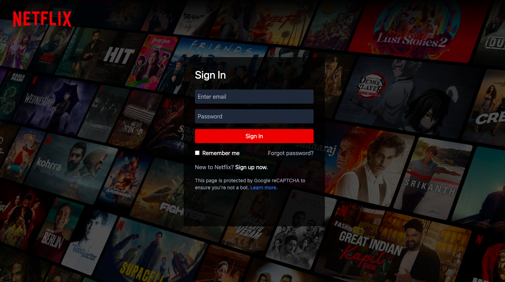
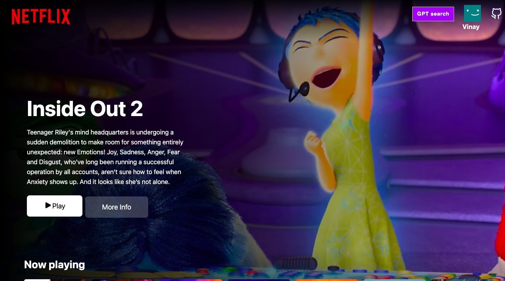

# NetFlixGPT

## Screenshot




## Features

- Authentication using firebase.
- Fetch and display the official trailer of a movie.
- tmdb api integration for fetching movie details.
- OPENAI api integration for generating movie recommendations.

## Getting started

To run NetFlixGPT on your system, follow these steps:

1. Clone the repository:
    ```sh
    git clone https://github.com/Vinay-Basargekar/NetFlixGPT.git
    ```

2. Navigate to the project directory:
    ```sh
    cd NetFlixGPT
    ```

3. Install the required dependencies:
    ```sh
    npm install
    ```

4. Set up your environment variables:
    Create a `constant.js` file in the `src/utils` directory and change the following code:
    ```js
    export const API_OPTIONS = {
      method: "GET",
      headers: {
        accept: "application/json",
        Authorization: `Bearer YOUR_TMDB_API_KEY`,
      },
    };

    export const OPENAI_KEY = `YOUR_OPENAI_KEY`;
    ```

5. Start the development server:
    ```sh
    npm start
    ```

6. Open your web browser and visit `http://localhost:3000` to access NetFlixGPT.
